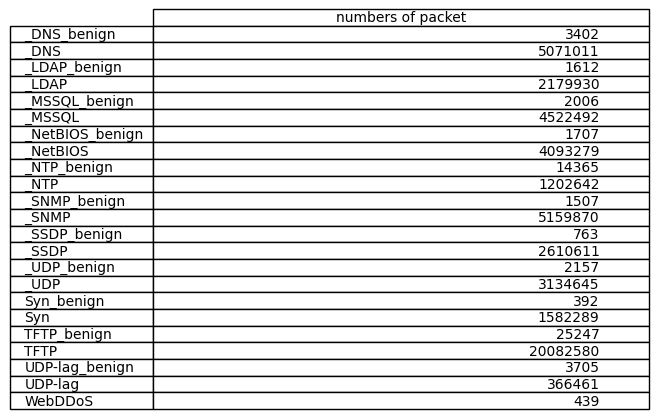
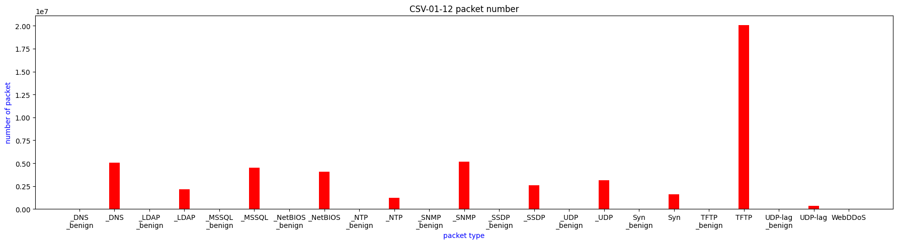

# CICDDoS2019_subset
Analysis and create subset dataset on CICDDoS2019 csv dataset.

## Requirement
* Python3
* Pandas
* Matplotlib

## Introduction of the repo(Usage)
CSV-01-12 and CSV-03-11 is the folder that put the data. It is empty because I don't put the dataset. It is too big.

The dataset has two csv files on different dates. I use the code on the "count_num" folder to count all the types of packets. The result is in "Introduction of the dataset" chapter.

* count_num folder put the code to count packet numbers.
* create_subset folder put the code to generate subset csv files.

### The output of the subset

1. CSV-01-12 folder: ...
2. CSV-03-11 folder: ...

## Introduction of the dataset
Source: https://www.unb.ca/cic/datasets/ddos-2019.html

In csv folder, there are two dates in tow folders.
* CSV-01-12: 11 items, totaling 22.3 GB.
* CSV-03-11: 7 items, totaling 8.7 GB.

### CSV-01-12:

As the image shows each file includes only benign and DDoS (the type is what the file name show). The only special is the "DrDoS_UDP" file not only contains UDP-lag DDoS and benign packets, it has WebDDoS packets (few, only 439 packets). 

### CSV-03-11:

...

## Contribution
If there is any code that can be accelerated, it is glad to get a PR about that.

## Todo
1. 03-11 data complete
2. README.md